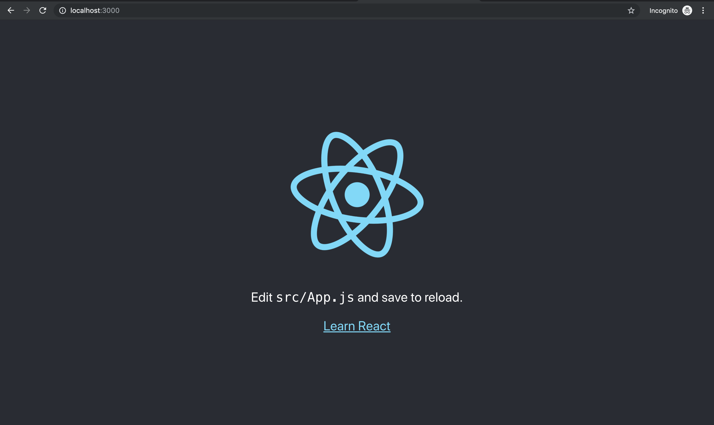
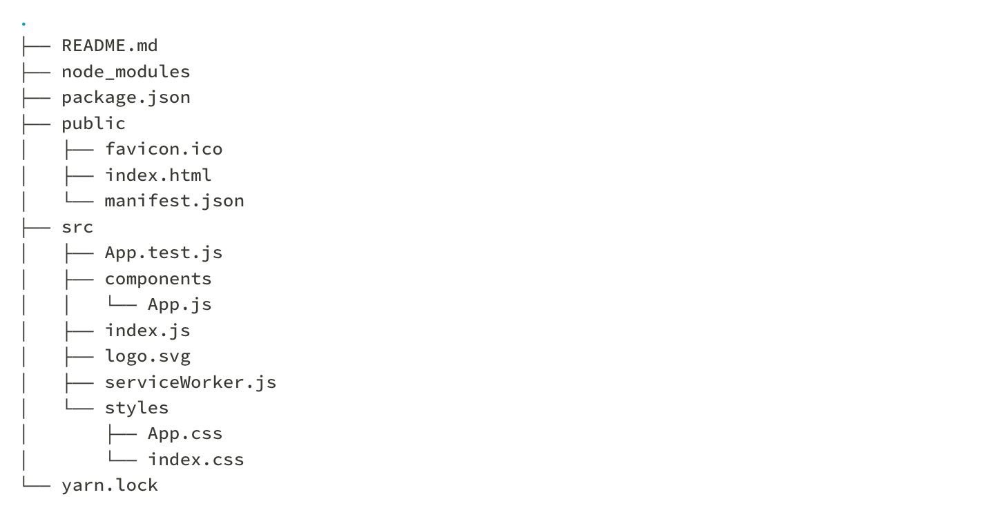

## Runnning the app 
```sh
$ git clone https://github.com/hackintoshrao/dgraph-graphql-js.git
$ cd dgraph-graphql-js
$ Install yarn
$ yarn add apollo-boost react-apollo graphql
$ yarn start
```

## Tutorial : Building the App
```sh
$ brew install yarn.
$ yarn global add create-react-app

$ create-react-app dgraph-graphql-basic

$  cd dgraph-graphql-basic/
$  yarn add apollo-boost react-apollo graphql
$  yarn start
```




---


To improve the project structure, move on to create two directories, both inside the src folder. The first is called components and will hold all our React components. Call the second one styles, that one is for all the CSS files you’ll use.

App.js is a component, so move it into components. App.css and index.css contain styles, so move them into styles. You also need to change the references to these files in both index.js and App.js accordingly:


```sh
$ mkdir components
$ mkdir styles 
$ mv App.js  components/
$ mv *css styles/
```


Make changes to the path in src/index.js, 

```js
import React from 'react'
import ReactDOM from 'react-dom'
import './styles/index.css'
import App from './components/App'

````


Make changes to the path in components/App.js

```js
import React, { Component } from 'react';
import logo from '../logo.svg';
import '../styles/App.css';
```


Your project structure should now look as follows:



---

Install Apollo client, react apollo and graphql libraries

```sh
$ yarn add apollo-boost react-apollo graphql
```

Here’s an overview of the packages you just installed:

- Apollo-boost 
    - apollo-client: Where all the magic happens
    - apollo-cache-inmemory: Our recommended cache
    - apollo-link-http: An Apollo Link for remote data fetching
    - apollo-link-error: An Apollo Link for error handling
    - apollo-link-state: An Apollo Link for local state management
    -  graphql-tag: Exports the gql function for your queries & mutations
    
- react-apollo contains the bindings to use Apollo Client with React.
    
- graphql contains Facebook’s reference implementation of GraphQL - Apollo Client uses some of its functionality as well.

---

```js
import React from 'react'
import ReactDOM from 'react-dom'
import './styles/index.css'
import App from './components/App'
import * as serviceWorker from './serviceWorker';

// 1
import { ApolloProvider } from 'react-apollo'
import { ApolloClient } from 'apollo-client'
import { createHttpLink } from 'apollo-link-http'
import { InMemoryCache } from 'apollo-cache-inmemory'


// 2
const httpLink = createHttpLink({
  uri: 'http://localhost:9000'
})

// 3
const client = new ApolloClient({
  link: httpLink,
  cache: new InMemoryCache()
})

// 4
ReactDOM.render(
  <ApolloProvider client={client}>
    <App />
  </ApolloProvider>,
  document.getElementById('root')
)
serviceWorker.unregister();

```

You’re importing the required dependencies from the installed packages.
Here you create the `httpLink` that will connect your ApolloClient instance with the Dgraph's GraphQL API, your GraphQL server will be running on http://localhost:9000.
Now you instantiate `ApolloClient` by passing in the `httpLink` and a new instance of an `InMemoryCache`.
Finally you render the root component of your React app. The App is wrapped with the higher-order component ApolloProvider that gets passed the client as a prop.

