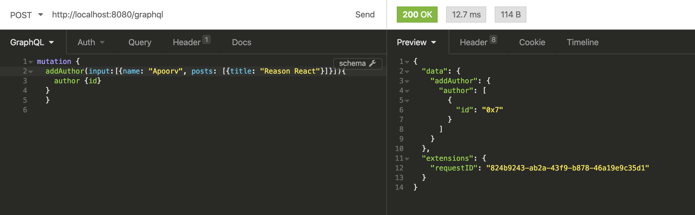

## Simple blog app
This is a simple GraphQL web application to demonstrate Dgraph's GraphQL capabilities.
The web app is built using ReactJS and Apollo-React client libraries.
And the GraphQL API's for the web app is powered by Dgraph.

[Dgraph](https://graphql.dgraph.io) is an open-source, distributed, and transactional graph database with a native GraphQL interface.

Using Dgraph, you can get GraphQL APIs without writing any code.

You need to define just the GraphQL type definitions, Dgraph auto-generates the GraphQL APIs for you.

These APIs provide you with capabilities to perform CRUD operations on the types defined.

Dgraph provides custom directives for your GraphQL type definitions. You need to add them to your GraphQL type definitions be able to make use of some of Dgraph's advanced database features.
Here are the docs explaining Dgraph's custom GraphQL directives.

Here is how we arrived at the GraphQL type definition for our blog application. 

Step 1: Define your application graph.
 
Note: Create an illustration with author, country, and blog linked together.

Step 2: Translate the application Graph into a GraphQL type definition. 

Step 3: Add Dgraph custom annotations.

----

## Runnning the app 

First clone the repo
```sh
$ git clone https://github.com/hackintoshrao/dgraph-graphql-js.git
$ cd dgraph-graphql-js
```

Starting dGraph and then loading the schema
```sh
$ docker run -it -p 8080:8080 dgraph/standalone:v1.2.0-rc1
$ jq -n --arg schema "$(cat schema.graphql)" '{ query: "mutation updateGQLSchema($sch: String!) { updateGQLSchema(input: { set: { schema: $sch }}) { gqlSchema { schema } } }", variables: { sch: $schema }}' | curl -X POST -H "Content-Type: application/json" http://localhost:8080/admin -d @- | jq -r
```

To execute a query or mutation you can use [GraphQL Playground](https://github.com/prisma-labs/graphql-playground), [Insomnia](https://insomnia.rest/), [GraphiQL](https://github.com/graphql/graphiql) and [Altair](https://github.com/imolorhe/altair). Fire one of those up and point it to [http://localhost:8080/graphql](http://localhost:8080/graphql) .
Then you can run couple of mutations to add Author to the database along with the Post they have published, to have some sample data to show up when you start the app -
```graphql
mutation {
  addAuthor(input:[{name: "Apoorv", posts: [{title: "Reason React"}]}]){
    author {id}
  }
  }
```
On the successful execution of the mutation - 


Open another terminal and start the React app
```sh
$ yarn install
$ yarn start
```

---